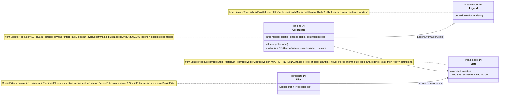
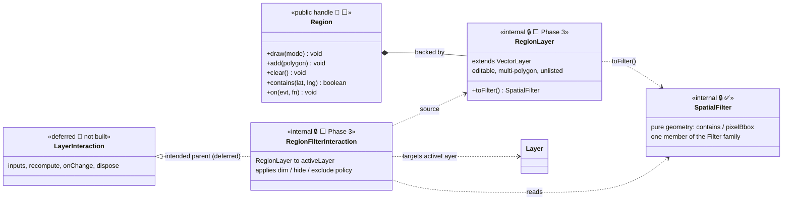

# FIMViz — Composable Core: Class Diagram

UML view of the object model — the map of *what owns what* and *what derives from what*, kept in sync with
the shipped code. For the *why* behind each shape (rationale, rejected alternatives, open questions), see
[DECISIONS_TRADEOFFS_INCOMPLETE_ITEMS.md](./DECISIONS_TRADEOFFS_INCOMPLETE_ITEMS.md); for exact method
signatures, see [usage/USAGE.md](./usage/USAGE.md) and the rest of `docs/usage/`.

**Status legend:** ✅ built · 🟡 partially built · ⬜ later phase · 🚫 deferred (not built until earned).
**Surface:** 👤 public · 🔒 internal. The user-facing vocabulary is deliberately small — see
[Spatial filtering](#spatial-filtering--multi-layer-interaction) for the class-count-vs-concept-count
principle.

> **`Dataset` is a lazy, immutable op-chain, not an eager value** — `reproject`/`select`/`mask`/`clip`/
> `reclassify`/`combine` are **methods on `Dataset`** returning new lazy nodes, forced only by a terminal
> (`load()`/`grid()`/`features()`) through registered seams (`registerReprojector`, `registerMaterializer`).
> `Storage` is a **generic** KV store (db/table/row, verbatim structured-clone values), not a Dataset store
> — the app names the database. `Catalog` is a **shape** (`{ list, load }`), not a class:
> `fimDatabaseCatalog(url)` satisfies it, as does `Storage` + `Dataset.fromRecord`. The FIM Scenario
> selection axis **folds into `Dataset`** via `axes`/`axis` + `select()` — an axis entry addresses
> either a separate file (a URL) **or a slice of the source already held** (`ref: { select: {…} }`),
> which is what lets one NetCDF/GRIB2/Zarr file back a whole time axis. Full rationale:
> [DECISIONS_TRADEOFFS_INCOMPLETE_ITEMS.md](./DECISIONS_TRADEOFFS_INCOMPLETE_ITEMS.md) §1.1.

---

## Object model

```mermaid
classDiagram
    direction TB

    class FimViz {
        <<namespace + ambient default ✅>>
        +create(options) FimMap$
        +mount(target, options) FimMap$
        +parseFile(source) Dataset$
        +current() FimViz$
        +reset() void$
        ~emitter : EventEmitter
        ~config : Config
        ~storage : Storage
    }

    class FimMap {
        <<instance ✅>>
        +app : FimViz
        +map : ProviderMap (google.maps.Map | L.Map)
        +storage : Storage
        +datasets : Dataset[]
        +layers : Layer[]
        +namedLayers : Layer[]
        +root : Element
        +addDataset(source, options) Dataset
        +addLayer(type?, opts) Layer
        +getLayer(id) Layer
        +removeLayer(idOrLayer) void
        +registerNamedLayer(name, layer) Layer
        +getLayerByName(name) Layer
        +$(sel) Element
        +$$(sel) Element[]
        +registerActions(map) FimMap
        +bindActions() FimMap
        +on(evt, fn) FimMap
        +off(evt, fn) FimMap
        +emit(evt, payload) FimMap
        +destroy() void
    }

    class Dataset {
        <<✅ lazy immutable op-chain; zero heavy imports>>
        +id : string
        +name : string
        +kind : raster/vector
        +format : geotiff/geojson/kml/kmz/shp/hazus/csv/xyz
        +crs : string (native, never assumed)
        +bounds : Bounds (in crs)
        +meta : object
        +axes : Array (selection axis: FIM Scenario stage, or a NetCDF/GRIB2/Zarr time axis)
        +selector : Object (an IN-FILE selection, set by select() off a selector ref)
        +warnings : string[]
        +isMaterialized : boolean
        +fromURL(url, opts)$ Dataset
        +fromRecord(rec)$ Dataset
        +fromGrid(value, opts)$ Dataset (wraps an already-decoded grid)
        +registerMaterializer(fmt, fn)$ +formats()$ : decode registry (statics)
        +registerReprojector(fn)$ +registerResampler(fn)$ : warp/resample seams (statics)
        +reproject(crs) Dataset (lazy op)
        +select(coord, opts) Dataset (lazy op)
        +reduce(op, opts) Dataset (lazy op)
        +mask(polygon, opts) Dataset (lazy op)
        +clip(bbox) Dataset (lazy op)
        +reclassify(rules, opts) Dataset (lazy op)
        +resampleTo(target, opts) Dataset (lazy op)
        +slope/aspect/hillshade(opts) Dataset (lazy op)
        +rasterize(opts) Dataset (lazy op, vector→raster)
        +combine(others, opts) Dataset (lazy op)
        +load() RasterGrid/VectorFeatures$ (terminal, forces+memoizes)
        +grid() RasterGrid$ (terminal)
        +features() VectorFeatures$ (terminal)
        +zonalStats(zones, opts) object (terminal)
        +release() void
        +toRecord(opts) object
        +toJSON() object
        +download() void
    }


    class Storage {
        <<✅ generic KV store, host names db/tables/keys>>
        +constructor(opts: {name, version?, tables?, resetTablesOnUpgrade?, versionMigrate?})
        +tables() string[]
        +createTable(t) bool
        +dropTable(t) bool
        +put(table, key, value) key
        +get(table, key) any
        +has(table, key) bool
        +delete(table, key) void
        +list(table, opts) Array
        +clear(table) void
        +clearAll() string[]
        +map(table, fn) number
        +table(name) StorageTable
        +close() void
        +destroy() void
    }

    class StorageTable {
        <<✅ sugar — table-bound row ops, no state of its own>>
        +name : string
        +put(key, value) key
        +get(key) any
        +has(key) bool
        +delete(key) void
        +clear() void
        +list(opts) Array
        +map(fn) number
    }

    class Catalog {
        <<✅ SHAPE, not a class>>
        list(opts) Entry[]
        load(id) Promise~Dataset~
        satisfied by fimDatabaseCatalog(url)
        and by Storage + Dataset.fromRecord
    }

    class Bounds {
        <<value object ✅>>
        +north : number
        +south : number
        +east : number
        +west : number
    }

    class Layer {
        <<abstract ✅ evented base built>>
        +id : string
        +type : string
        +sources : Dataset[]
        +dataset : Dataset
        +result : any (set by compute())
        +on/off/once/emit() : evented (L.Evented-style; UI subscribes)
        +remove() : fires 'removed' synchronously
        +settings : LayerSettings
        +colorScale : ColorScale
        +visible : boolean
        +exclusive : boolean
        +dirty : boolean (an op is applied but not yet drawn)
        +map : FimMap
        +registerType(type, factory)$ +types()$ : layer-type registry (statics)
        +show() void
        +hide() void
        +remove() void
        +fit() void
        +hitTest(lat, lng) boolean
        +async compute(opts) any
        +async render(opts) Layer
        +setSources(sources, opts) Layer
        +deriveSources(fn, opts) Layer
        +clip/mask/reclassify/resampleTo(…) Layer  %% the Dataset ops, chainable
        +slope/aspect/hillshade/reproject/select/reduce(…) Layer
        +async reset(opts) Layer (back to the pre-op sources)
        +getLegend() Legend
        +async getStats() Stats
    }

    class RasterLayer {
        <<✅ registered "raster">>
        type: extent/userRaster/depth/ensemble
        colorize grid → canvas → provider.addRasterImage
        +valueAt(lat, lng) number
    }
    class VectorLayer {
        <<✅ registered "vector">>
        type: geojson/kml/kmz/shp/csv/xyz
        render() is SYNCHRONOUS
        +colorScale : ColorScale  %% the SAME class a raster uses
        +colorBy : string (the feature property it reads)
        +featureAt(lat, lng) Feature
        +getLegend() Legend
        +async getStats(opts) Stats  %% from GeoJSON — headless, provider-neutral; byClass via colorScale
    }
    class ComparisonLayer {
        <<✅ registered "comparison">>
        N-ary (2-8) align + classify-which-subset + 2-ary metrics
        +compute(opts) object · +prepare() · +getAligned() · +metricsForMask(mask)
    }
    class EnsembleAggregationLayer {
        <<✅ registered "ensembleAgreement">>
        N-ary align + reduce-how-many-wet (agreement count 0..N)
        +compute(opts) object · +prepare() · +getAligned()
    }
    class VelocityLayer {
        <<✅>>
        raster pair + rAF animation (Google-only, exclusive)
    }
    class FloodDepthLayer {
        <<✅ engine layers/depthMap.js + floodDepth.js>>
        ArcGIS MapServer tiles (Google-only)
    }
    class DamageLayer {
        <<✅ app-tier layers/damage.js>>
        HAZUS point markers (AdvancedMarkerElement)
    }
    class EnsembleLayer {
        <<✅ engine layers/ensemble.js>>
        single pre-baked-GeoTIFF renderFile subclass
    }
    class DepthLayer {
        <<✅ engine layers/depthMap.js>>
        renderFile subclass, per user-file registry
    }

    class LayerSettings {
        <<abstract ✅>>
        +opacity : number
        +hover : boolean
        +get(key?) any
        +set(partial) Promise
        +reset() Promise
    }
    class RasterSettings {
        <<✅>>
        +colorScale : ColorScale (references layer's, not a copy)
        +noData : number
        +overrideTheme : boolean
    }
    class VectorSettings {
        <<✅>>
        +color : string
        +useFileColors : boolean
        +colorScale : ColorScale (references the layer's, not a copy)
        +colorBy : string (feature property → value)
        +palette/continuous/missingColor : route to that scale
    }

    class ColorScale {
        <<✅ 3 mutually-exclusive modes: palette / classed-stops / continuous-stops>>
        +kind : classed/continuous
        +isExplicit : boolean
        +palette : string/Array
        +unit : string
        +missingColor : string (colour for an absent value; outside the 3 modes)
        +colorFor : function (override, checked first)
        +getStops() Array
        +getValues() number[]
        +getRange(i) Range
        +getColor(value) string
        +getRgb(value) number[]
        +set(patch) ColorScale  %% palette/min/max/continuous/unit/stops — the ONE knob writer
        +setStops(stops) ColorScale
        +setColorStops(values, colors) ColorScale
        +continuous(bool) ColorScale
        +setRange(i, range) ColorScale
        +setColor(iOrValue, color) ColorScale
        +setLabel(i, label) ColorScale
        +continuous : boolean (getter)
        +onChange(fn) / offChange(fn) ColorScale
        +fromGdalLegend(legend, unit)$ ColorScale
        +registerPalette(name, colors)$ +palettes()$ : open registry (statics)
    }

    class Legend {
        <<✅>>
        +unit : string
        +kind : classed/continuous
        +source : gdal/palette/default/custom
        +stops : Array
        +formatLabel : function
        +formatValue : function
        +fromColorScale(cs, opts) Legend$
        +toHtml() string
    }

    class Stats {
        <<✅>>
        +kind : raster/vector
        +min/max/mean/median/stddev/sum/count
        +histogram : object
        +area : number
        +byClass : Array
        +propertySummary : object
        +percentile(p) number
        +diff(other) object
        +describe() string
        +toJSON() object
        +toCSV() string
        +download(name) void
        +raster(pixelData, meta, opts) Stats$
        +vector(dataLayer, opts) Stats$
    }

    class Filter {
        <<internal ✅>>
        +test(unit) boolean
        +from(input) Filter$
    }
    class SpatialFilter {
        <<internal ✅>>
        polygon(s); universal (raster+vector)
        +features : Polygon[]
        +contains(lat, lng) boolean
        +pixelBbox(meta) Bbox
        +isEmpty() boolean
    }
    class PredicateFilter {
        <<internal ✅>>
        raster (v,x,y,at) / vector (feature)
    }

    class Component {
        <<abstract 🚫 superseded — see note>>
        +constructor(root, ctx)
        +update() void
        +destroy() void
    }
    class LayerPanel {
        <<✅ as createLayerPanel(root), app-tier>>
        instance-bound, 4 tabs (file-spec/layer-settings/metrics/legend)
    }
    class RasterToolsPanel {
        <<✅ as createRasterToolsPanel(root), app-tier>>
        Image Tools panel: raster + vector modes
    }
    class UiHelpers {
        <<✅ as createUiHelpers(root), app-tier>>
        toast/tooltip/legend/scenario-sync helpers
    }

    %% ---- ownership / composition ----
    FimViz "1" o-- "*" FimMap : owns (ref-counted default)
    FimViz "1" *-- "1" Storage : shared services
    FimMap "*" --> "1" FimViz : up-chain app
    FimMap "1" o-- "*" Dataset : registry
    FimMap "1" o-- "*" Layer : registry
    Dataset "1" *-- "1" Bounds
    warp ..> Dataset : (ds, toCrs) → new Dataset
    Storage ..> Dataset : verbatim via toRecord/fromRecord
    Catalog ..> Dataset : load(id) → Dataset
    Storage ..> Catalog : satisfies (local, + Dataset.fromRecord)
    Storage "1" ..> "*" StorageTable : table(name) → handle

    %% ---- Layer subtree ----
    Layer <|-- RasterLayer
    Layer <|-- VectorLayer
    Layer <|-- VelocityLayer
    Layer <|-- FloodDepthLayer
    Layer <|-- DamageLayer
    Layer <|-- ComparisonLayer
    Layer <|-- EnsembleAggregationLayer
    RasterLayer <|-- EnsembleLayer
    RasterLayer <|-- DepthLayer
    Layer "*" --> "1" FimMap : up-chain
    Layer "1" --> "*" Dataset : sources
    Layer "1" *-- "1" LayerSettings
    Layer "1" *-- "1" ColorScale

    %% ---- Settings subtree ----
    LayerSettings <|-- RasterSettings
    LayerSettings <|-- VectorSettings
    RasterLayer ..> RasterSettings : uses
    VectorLayer ..> VectorSettings : uses

    %% ---- Phase 2 read-models ----
    Legend ..> ColorScale : derived from
    Layer ..> Legend : getLegend()
    Layer ..> Stats : getStats()
    RasterSettings ..> ColorScale : routes to
    VectorSettings ..> ColorScale : routes to (colorBy grading)
    Filter <|-- SpatialFilter
    Filter <|-- PredicateFilter
    Stats ..> Filter : scoped by (compute-time)
    Stats ..> ColorScale : byClass buckets
    FimMap ..> SpatialFilter : region → filter

    %% ---- Components (built as per-instance factories, NOT a shared base class) ----
    LayerPanel ..> FimMap : bound to (per-instance factory)
    RasterToolsPanel ..> Layer : bound to (per-instance factory)
    UiHelpers ..> FimMap : bound to (per-instance factory)
```

**Note on `Component`:** the generic mountable-Component base class (`fim.renderLayerPanel('#panel')`,
`layer.renderLegend('#legend')`) sketched in the original design was never built. What shipped instead is
the **per-instance factory** pattern used throughout the UI tier — `createLayerPanel(root)`,
`createRasterToolsPanel(root)`, `createDamageToolsPanel(root)`, `createUiHelpers(root)` — each a plain
closure over a root element, not instances of a shared `Component` base. `ui/velocityTools.js`/
`ui/ensembleTools.js`/`ui/floodDepthTools.js`/`ui/comparisonTools.js` follow the same shape but as
**event-inversion binders** (`bind*Tools(fim)`) rather than mountable panels. These are host-application
concerns, not part of this package — there is no plan to package them as a separate library (§5.1 of
[DECISIONS_TRADEOFFS_INCOMPLETE_ITEMS.md](./DECISIONS_TRADEOFFS_INCOMPLETE_ITEMS.md)) — and a formal
`Component` base is not planned either.

---

## Phase 2 read-models — the read-model triangle (built)

These classes are **built** (`src/package/{colorScale,legend,stats,filter}.js`) and
the existing code each was extracted from:



### ColorScale's modes

The one non-obvious point: `ColorScale` unifies the coloring paths that existed separately in the
original code.

| Mode | State | Color source | Backing code |
|---|---|---|---|
| **palette-scale** | `{ palette, min, max, continuous }` | computed per-value via `getRgbForValue` | `rasterTools.js` palette table |
| **explicit-stops** | `_stops: [{ value \| range, color, label }]` | looked up in the stops array | `depthMap.js` GDAL legend / `buildDefaultDepthLegend` |
| **continuous color stops** | `setColorStops(values, colors)` | interpolated between the bracketing control points | added with the composable core |

Orthogonal to all three: **`missingColor`** — what an absent value (`null`/`NaN`/`''`) is painted,
`null` meaning "the consumer decides" (a vector layer leaves the feature at its base style; a raster
leaves the pixel transparent). A mode switch leaves it untouched.

**Not raster-only.** The same instance serves a `VectorLayer` via `colorBy`, which names the feature
property whose value the scale reads — so `getLegend()` and `getStats().byClass` work identically on
either kind.

`getStops()` returns the same shape either way (palette bands are *derived*, GDAL stops are
*stored*), which is what lets `Legend` and the render loop treat both uniformly.

---

## Spatial filtering & multi-layer interaction

The polygon / free-form draw that clips raster stats, dims raster pixels, and filters HAZUS
damage buildings is **triplicated** today — each of `ui/rasterTools.js`, `ui/damageTools.js`,
and `layers/comparison.js` carries its own copy of both the *geometry* (`pointInPolygon` +
`polygonPixelBbox`) and the *interaction* (draw listeners, snap, capture div). The composable
model factors this into one internal object model behind a one-concept public surface.

### The governing principle

> **Class count is an internal cost; concept count is the user's cost.** Grow the first only
> to *hold or shrink* the second.

A user thinks of the drawn area as **one thing — a `Region`**. So however many internal
objects the correct model needs (geometry vs. policy must stay split), the public surface
exposes exactly one handle, and the interaction is **implicit**:

```js
fim.region.draw();                 // draw polygon(s) — multi-polygon just works
const s = await layer.getStats();  // already filtered to the region — no interaction object
```

### Public vs. internal surface

| Internal object | Status | Public exposure | Why hidden / shown |
|---|---|---|---|
| `SpatialFilter` (pure geometry, was `RegionFilter`) | ✅ built | **none** | plumbing that `Stats`/render consume; dedups the 3 copies |
| `PredicateFilter` (value / callback) | ✅ built | via `layer.applyFilter(fn)` | the `Array.filter`-style predicate over pixels/features |
| `RegionLayer` (extends VectorLayer) | ⬜ Phase 3 | as `fim.region` → a small **Region** handle | user thinks "my selection", not "a vector layer" |
| `RegionFilterInteraction` | ⬜ Phase 3 | **none** — implicit | drawing a region auto-filters `activeLayer` |
| `LayerInteraction` (base) | 🚫 **deferred** | **none** | not built until a 3rd interaction earns it |
| `ComparisonInteraction` | 🚫 deferred (open question) | as `fim.compare(a, b)` | one friendly verb |
| `activeLayer` | ⬜ Phase 3 | `fim.activeLayer` / `layer.select()` | one simple concept |

### Model



### Why these choices

- **Region as a layer, not a tool.** The drawn polygon *is* map geometry; modeling it as an (editable,
  unlisted) `VectorLayer` makes **multi-polygon fall out for free** (a `Region` is N features, `contains()`
  = "inside any feature") and reuses vector hit-testing instead of triplicated capture-div code.
- **Geometry split from policy.** `SpatialFilter` is *pure geometry*; behavior differs per consumer —
  raster render **dims** outside (alpha 100), stats **exclude**, damage **hides** — so policy stays with the
  consumer, keeping the filter reusable/testable.
- **The drawn region is one member of a `Filter` family.** `SpatialFilter` (polygon(s), universal) is what
  the user draws; `PredicateFilter` is `(v,x,y,at)`/`(feature) => bool`. `layer.applyFilter(f)` **mutates the
  view** (render + default stats honor it), chainable (AND); `layer.getStats(f)` is a compute-only one-off.
  Filtering is a *layer/query* concern — never `stats.applyFilter` (a `Stats` has already reduced the pixels
  away; that would stop it being a pure read-model).
- **`LayerInteraction` deferred.** Region-filter *mutates* its target; comparison *emits* a new overlay —
  they barely share a contract, so the base isn't yet earned (built when a third interaction forces it).
  Likewise **`ComparisonLayer` → `ComparisonInteraction`** would reverse the resolved "ComparisonLayer is a
  `Layer` subclass" decision — deferred until the base exists.

**Phasing:** the pure `Filter` predicates + the filter-aware enriched `Stats` landed in **Phase 2**
(removing the triplication); `Region`/`RegionLayer`/`RegionFilterInteraction`/`activeLayer`/
`layer.applyFilter` remain **Phase 3/5** work (need the `Layer` object + map interaction — `Layer` itself is
done, but this spatial-filtering wiring on top of it isn't).

## Domain formats — FIM Database & FIM Scenario (deliberately absent from the neutral core)

Two app-specific JSON formats are **not** generic geospatial files — the neutral core stays format-agnostic
(`parseFile` never learns their schemas) — and **not** equally proprietary: **FIM Database** is a directory
listing (`{ files: [{ FileName }] }`, siblings next to the manifest); its adapter `fimDatabaseCatalog(url)`
(✅ `io/fim/`, ~10 lines) satisfies the `Catalog` *shape* directly (no `Catalog`/`LocalCatalog` class — a
local catalog is just `Storage` + `Dataset.fromRecord`; `load(id)` = `parseSource(base +'/'+ id)`). **FIM
Scenario** is a genuine schema (extent rasters + a model/stage/discharge axis — the slider); it **folds into
`Dataset`** via the `axes` selection axis, fed by the **✅ built** app-tier `parseFimScenario` adapter (not a
`Scenario` class above `Dataset` — the axis lives on `Dataset` itself). Full rationale:
[DECISIONS_TRADEOFFS_INCOMPLETE_ITEMS.md](./DECISIONS_TRADEOFFS_INCOMPLETE_ITEMS.md) §1.1/§1.3.

## Cross-references

- **Class contracts, as built:** [usage/USAGE.md](./usage/USAGE.md) and the rest of `docs/usage/`; the
  generated per-parameter reference is [docs/api/](./api/).
- **Design rationale, tradeoffs, and implementation status:**
  [DECISIONS_TRADEOFFS_INCOMPLETE_ITEMS.md](./DECISIONS_TRADEOFFS_INCOMPLETE_ITEMS.md).
- **Forward-looking roadmap (not yet started):** [PACKAGE_ROADMAP.md](./PACKAGE_ROADMAP.md).
